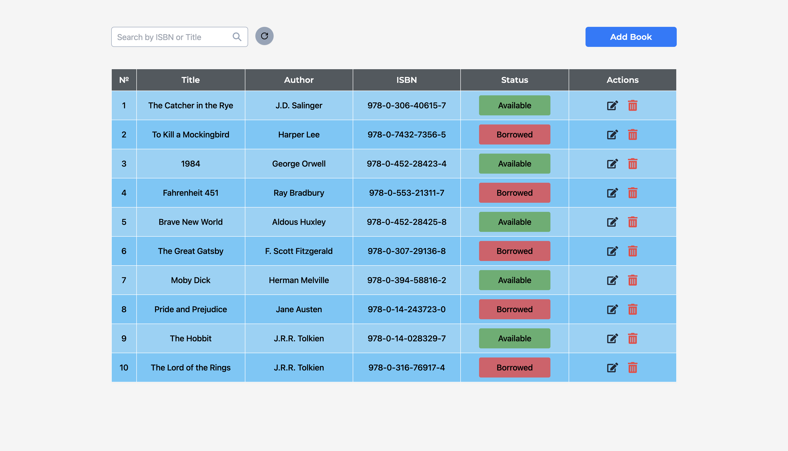

# Shelf-Smart - Library Management System

## Introduction

Welcome to Shelf-Smart, a cutting-edge library management system that empowers librarians to
efficiently manage their book collections. This platform is designed to simplify the daily tasks of
cataloging, tracking, and organizing books, making it easier than ever to maintain a
well-functioning library. Whether you're managing a small community library or a large academic
collection, Shelf-Smart offers the tools you need to keep everything in order.

## Features

- **Books List Page:** Displays a comprehensive list of all books in the library's collection.
- **Add Book Page:** Provides a form for adding new books with title, author, and ISBN.
- **Edit Book Page:** Allows updating details of existing books.
- **Delete Book Functionality:** Enables the removal of books from the library's
- **Book Status Management:** Allows marking books as borrowed or returned.
- **Search Functionality:** Enables searching for books by title or ISBN, with backend queries.

## Screenshots

## Technologies Used:

## Demo

Here you can see back-end part of website:
[**shelf-smart-backend**](https://github.com/skabanets/shelf-smart-backend)
